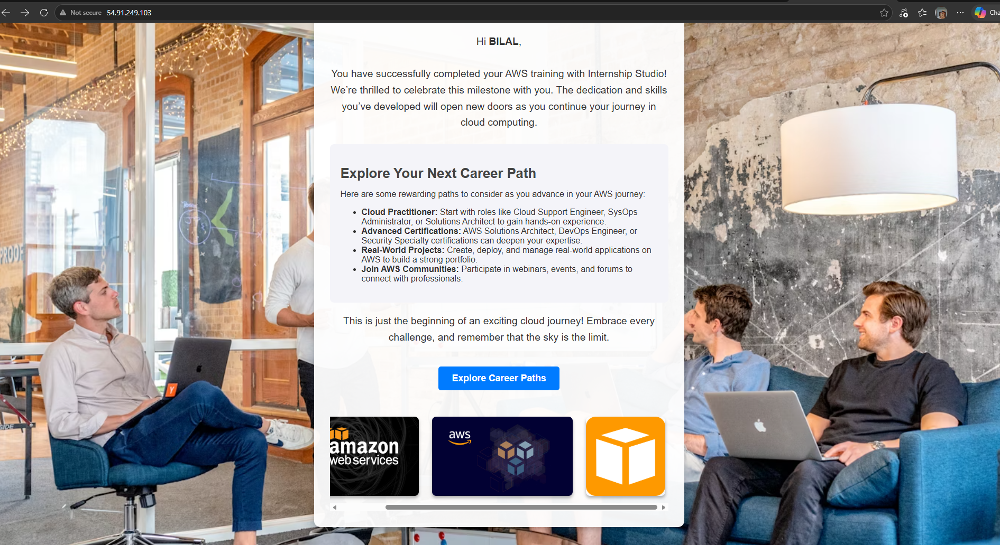

# ☁️ AWS Internship Project – EC2 Web Hosting

---

## 📌 Overview

This project was completed as part of the **AWS Internship Program at iStudio (Internship Studio)**.  
The objective was to gain hands-on experience with Amazon Web Services by launching, configuring, and deploying a live web application on an **EC2 instance**.

---

## 🖥️ Project Screenshot

---

## 🚀 What I Did

- ✅ Launched an **EC2 instance** (t3.micro) on AWS in the `us-east-1` region
- ✅ Generated and configured a **Key Pair** for secure SSH access
- ✅ Set up **Security Groups** to allow HTTP (port 80) and SSH (port 22) inbound traffic
- ✅ Connected to the server remotely via **SSH**
- ✅ Hosted and served a **live web page** accessible via the EC2 public IPv4 address
- ✅ Managed the full **EC2 instance lifecycle** — launch, configure, deploy, terminate

---

## 🛠️ Tech Stack

| Service | Purpose |
|---|---|
| AWS EC2 (t3.micro) | Virtual cloud server |
| AWS Security Groups | Network traffic control |
| SSH / Key Pair | Secure remote access |
| HTTP | Web page serving |
| Amazon Linux | Server OS |

---

## 📚 Key Learnings

- Cloud infrastructure provisioning on AWS
- EC2 instance setup and configuration
- Network security rules with Security Groups
- Remote Linux server management via SSH
- Understanding of cloud deployment lifecycle

---

## 📄 Offer Letter

The official internship offer letter is included in this repository:  
📎 [Mohammed Bilal D - AWS Internship - Offer Letter.pdf](./offer-letter.pdf)

---

## 🏢 Internship Details

| Field | Details |
|---|---|
| Organization | iStudio (Internship Studio) |
| Program | AWS Internship |
| Joining Date | 18th February, 2026 |
| Duration | 3 Months |
| Batch | 18th February, 2026 |

---

> *"The skills and knowledge gained through this internship serve as a strong foundation for advancing in cloud computing and AWS architecture."*
